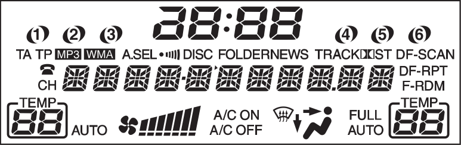

# SpaceshipConnect, Arduino part

Connects to audio system, HVAC system and combined display of Honda Civic VIII 5D.



Contains code to work with any MSM6775-driven LCD and DS1302 real-time clock.

The `SpaceshipDisplay` class provides high-level control of all LCD segments.
Example:
   ```c++
   display.clock.hour(23);
   display.clock.minute(59);
   display.text.showString(0, "Honda Civic");
   display.hvac.leftAuto(true);
   display.hvac.leftTemp(20);
   display.hvac.rightTemp(SpacehipDisplay::Hvac::TEMP_LO);
   ```

Text section uses a [font](display/section_text.cpp) supporting a wide range of characters
in [Windows-1251](https://en.wikipedia.org/wiki/Windows-1251) encoding.

[Main sketch](SpaceshipConnector.ino) provides functionality similar to a Connects2 CTSHO002 adapter.
Additionally, it can interact with a connected Android device.
